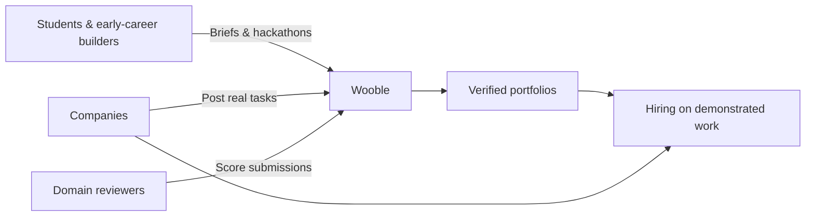

<div align="center">


**Founder & CEO, [Wooble](https://wooble.org)** · KIIT '19 · Bhubaneswar  
*Betting on skills at the workplace — hire on proof, not pedigree.*

[](https://wooble.org)
[](https://linkedin.com/in/akash-jaiswal-wooble)
[](https://akashjaiswal.com)

</div>

---

### The short version

India produces millions of graduates every year. Most are filtered by college brand and a paper resume — not by what they can actually build. I founded **Wooble** to fix that: a proof-of-work hiring marketplace where candidates earn credibility through **real company briefs**, **hackathons**, and **expert-reviewed portfolios**.

> *"I saw hiring from both sides — students desperate to prove ability, employers drowning in resumes that say almost nothing. The asymmetry was glaring."*

---

### By the numbers

| Wooble (platform) | My GitHub |
| --- | --- |
| **2.24L+** registered candidates | **4,000+** contributions last year |
| **200+** company partners | **3,500+** commits · **490+** PRs |
| **5,877+** placements facilitated | **146** repositories shipped |
| **150+** colleges via BPUT MoU | Building on GitHub since **2016** |
| **Rs. 7 Cr+** ARR run rate | Orgs: **@Wooble-org** · **@woobledev** |

---

### How Wooble works



Three sides, one signal: **credibility from scored work**, not college tier.

---

### What I'm shipping (open source)

| Repo | What it is | Stack |
| --- | --- | --- |
| [**wooble-company**](https://github.com/Wooble-org/wooble-company) | Company hiring surface — proof-of-work recruiting | `Next.js` `TypeScript` `PostgreSQL` |
| [**wooble-engine**](https://github.com/Wooble-org/wooble-engine) | Candidate marketplace — briefs, portfolios, placements | `PHP` |
| [**wooble-android**](https://github.com/Wooble-org/wooble-android) | Android app for hackathons & portfolios | `Kotlin` |
| [**horizonn**](https://github.com/Wooble-org/horizonn) | Multi-tenant HR platform | `PHP` |
| [**horizonn-b2b**](https://github.com/Wooble-org/horizonn-b2b) | B2B HR console | `TypeScript` |

Currently migrating Wooble's company surface from PHP → **Node/Next.js** while keeping the candidate engine live at scale.

---

### Builder's log — a decade of shipping

```
2016 ──► First commits on GitHub (KIIT, Bhubaneswar)
2019 ──► Freelance product work · Team Hi-Tech — saw hiring's broken asymmetry
2020 ──► Wooble born in an incubation centre — 3 interns, one conviction
2022 ──► Proof-of-work model live — briefs, portfolios, domain reviewers
2023 ──► Placements begin · campus partnerships · Wooble Nexus speaker series
2024 ──► PAN India expansion · 85K+ candidates · enterprise hiring (Tata Steel+)
2025 ──► 2L+ candidates · BPUT MoU (150+ colleges) · modern stack migration
2026 ──► 5,877+ placements · Rs. 7 Cr+ ARR · Next.js company product shipping
```

**Stack evolution:** `PHP` `JavaScript` → `TypeScript` `Next.js` `Kotlin` `Python` `PostgreSQL` `LiveKit`  
*(9 years of repos — from campus hackathon code to production hiring infrastructure)*

---

### Tech I work with

<p align="center">
  
  
  
  
  
  
  
  
  
  
</p>

---

### Recognition

**Press:** Hindustan Times Brunch · The Times of India  
**Founder lists:** Outlook India — 15 Youngest Entrepreneurs to Watch (2022) · Fox Story — 100 Emerging Entrepreneurs (2023) · GlantorX — 100 Future Leaders (2023)  
**Ecosystem:** Startup India · MeitY Startup Hub · Google for Startups · STPI · Startup Odisha  
**Academic:** Featured in an AIMS management case study (2026) — *"Wooble: Betting on Skills at the Workplace"*

---

### GitHub activity

<p align="center">
  
  
</p>

<p align="center">
  
</p>

---

<div align="center">

**From a 3-intern incubation-centre startup to PAN India. Still shipping.**

*If you're building in hiring, marketplaces, or EdTech — or you're tired of screening resumes that say almost nothing — [let's connect](https://linkedin.com/in/akash-jaiswal-wooble).*

</div>
